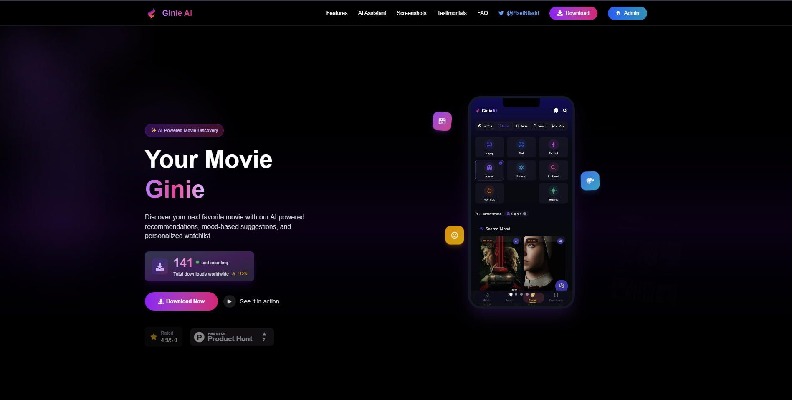

# 🎥 Ginie - AI-Powered Movie Discovery App

> **Note**: The main repository is private. This is a public showcase.

## 🚀 Overview

Ginie is an intelligent Android application that revolutionizes how you discover and interact with movies and TV shows. Powered by our custom-trained Ginie AI model built on Llama 3.5, it offers unprecedented search capabilities and personalized recommendations.

### ✨ Key Capabilities

- **AI-Powered Scene Search**: Describe any movie scene with just a few details and find the exact movie
- **Smart Recommendations**: Personalized suggestions based on your viewing preferences
- **Multi-Platform Downloads**: Support for YouTube, Spotify, and Terabox content
- **Comprehensive Discovery**: Browse trending, top-rated, and upcoming content

### 🎬 Live Demos

Experience Ginie's powerful AI capabilities through our demo videos:

<div align="center">

| Platform | Demo Link | Description |
|----------|-----------|-------------|
| 🐦 **X/Twitter** | **[Watch Demo](https://x.com/pixelNiladri/status/1911432555611512977)** | Quick feature overview and UI showcase |
| 🎥 **YouTube** | **[Full Walkthrough](https://www.youtube.com/watch?v=qxS3Uccl224)** | Complete app demonstration and AI features |

</div>

> 💡 **Tip**: Watch the YouTube demo for a comprehensive understanding of Ginie's AI-powered scene search and recommendation engine in action!

## 📱 Screenshots


*Ginie's intuitive landing page interface*

## 🛠️ Technology Stack

### **Frontend Architecture**
- **React Native + Expo**: Cross-platform mobile development
- **Expo Router**: File-based navigation system
- **MotiView & Reanimated**: Smooth animations and transitions

### **Backend Infrastructure**
- **Appwrite Cloud**: Backend-as-a-Service platform
- **Ginie AI**: Custom fine-tuned Llama 3.5 model running locally

## 🎯 Features

### **Content Discovery Engine**
- Browse trending, top-rated, and upcoming movies & TV shows
- Advanced category filtering (Movies, TV Series, Documentaries)
- Intelligent search with auto-suggestions
- Genre-based content filtering
- Real-time content updates

### **AI-Powered Intelligence**
- **Scene Recognition**: Describe any movie scene to find the title
- **Behavioral Analysis**: Personalized recommendations based on user interactions
- **Trend Analysis**: Community-driven trending content discovery
- **Smart Matching**: AI algorithms for content similarity

### **Premium User Experience**
- **Performance Optimized**: Skeleton loading screens for seamless browsing
- **Interactive Elements**: Pull-to-refresh functionality across all screens
- **Fluid Animations**: Smooth transitions powered by Reanimated
- **Responsive Design**: Optimized for all Android screen sizes
- **Offline Support**: Cache management for uninterrupted browsing

### **Download Capabilities**
- YouTube video and audio downloads
- Spotify track downloads
- Terabox file management
- Multiple format support
- Download queue management

## 🚀 Getting Started

### Prerequisites
- Node.js (v16 or higher)
- Expo CLI
- Android Studio (for Android development)
- Appwrite account

### Installation
```bash
# Clone the repository (if you have access)
git clone https://github.com/your-username/ginie-app.git

# Navigate to project directory
cd ginie-app

# Install dependencies
npm install

# Start the development server
expo start
```

## 🏗️ Architecture

```
├── src/
│   ├── components/     # Reusable UI components
│   ├── screens/        # App screens
│   ├── services/       # API and external services
│   ├── utils/          # Helper functions
│   └── ai/            # Ginie AI integration
├── assets/            # Images, fonts, and static files
└── app.config.js      # Expo configuration
```

## 🤖 AI Model Details

**Ginie AI** is our proprietary model fine-tuned on Llama 3.5 with:
- **Movie Scene Database**: Trained on thousands of movie descriptions and scenes
- **User Behavior Patterns**: Learning from user interaction data
- **Content Metadata**: Rich understanding of movie and TV show attributes
- **Local Processing**: Runs entirely on-device for privacy and speed

## 🔮 Roadmap

- [ ] iOS version development
- [ ] Web application launch
- [ ] Advanced AI features (voice search, image recognition)
- [ ] Social features (reviews, ratings, sharing)
- [ ] Integration with streaming platforms
- [ ] Multi-language support

## 🤝 Contributing

We welcome contributions! Please read our contributing guidelines and code of conduct before submitting pull requests.

## 📄 License

This project is licensed under the MIT License. See the [LICENSE](LICENSE) file for complete details.

## 💖 Support the Project

If Ginie has enhanced your movie discovery experience, consider supporting our development:

[](https://buymeacoffee.com/niladri)

## 👨‍💻 Developer

**Niladri Hazra**
- 🌐 Portfolio: [niladrihazra.site](https://niladri.tech)
- 🐙 GitHub: [@NiladriHazra](https://github.com/NiladriHazra)
- 🐦 Twitter: [@PixelNiladri](https://x.com/pixelNiladri)

---

<p align="center">
  <strong>Built with ❤️ for movie enthusiasts worldwide</strong><br>
  <em>Last updated: May 23, 2025</em>
</p>